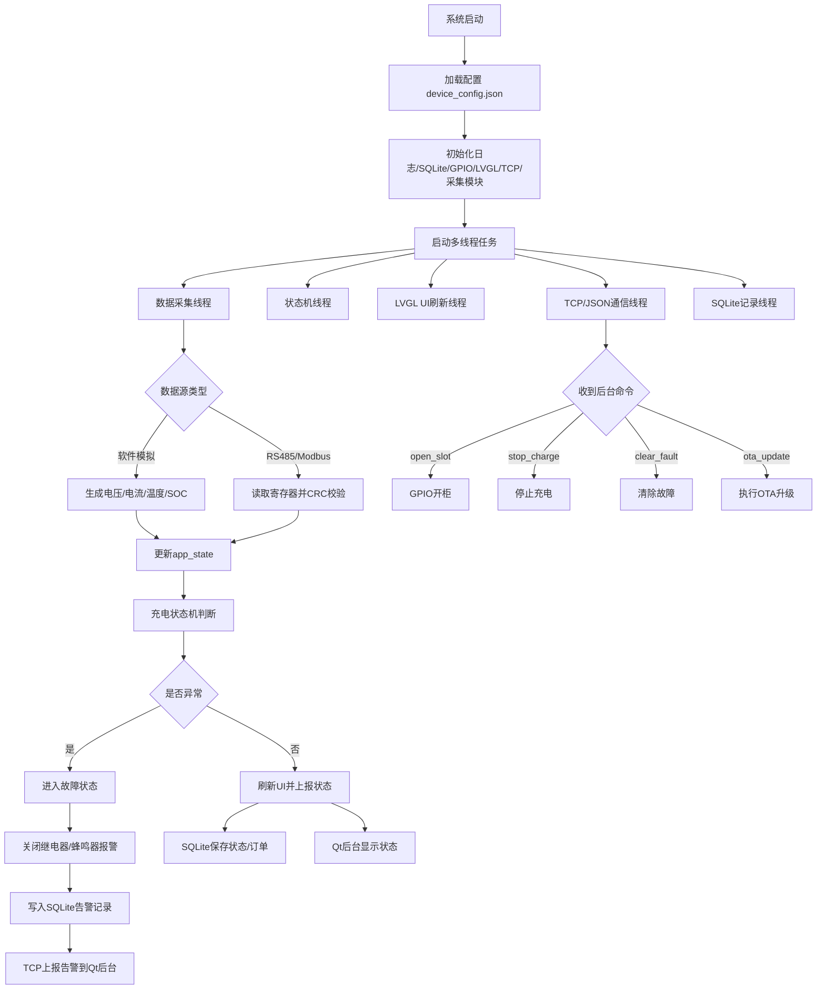

# 基于 IMX6ULL 的智能充电柜监控与远程运维终端系统技术路线

> 项目定位：本项目不接入真实强电充电回路，而是采用软件模拟、UART 模拟或 RS485/Modbus 模拟采集模块生成电压、电流、温度、SOC 等数据，重点验证嵌入式 Linux 终端的软件架构、状态机、设备通信、数据追溯、远程控制和 OTA 运维能力。

---

## 1. 项目总体定位

本项目建议定位为：

**基于 IMX6ULL 的智能充电柜监控与远程运维终端系统**

核心不是实现真实大功率充电，而是模拟真实充电柜终端的软件系统，重点体现嵌入式 Linux 应用层开发能力。

### 核心业务流程

```text
多仓位管理
    ↓
模拟电压 / 电流 / 温度 / SOC 数据采集
    ↓
充电状态机控制
    ↓
异常检测与报警
    ↓
LVGL 本地界面显示
    ↓
SQLite 保存订单和告警记录
    ↓
TCP/JSON 上传 Qt 后台
    ↓
后台远程开柜、停止充电、查看日志、OTA 升级
```

### 项目适合体现的能力

```text
Linux C/C++
pthread 多线程
LVGL 本地界面
GPIO / 继电器 / 蜂鸣器控制
SQLite 数据库
TCP/JSON 网络通信
Qt 后台管理
RS485 / Modbus RTU
systemd 自启动
日志系统
OTA 简易升级
CMake 工程组织
```

---

## 2. 总体技术架构图

```text
┌─────────────────────────────────────────────────────────────┐
│                    Mac / PC Qt 后台管理端                    │
│                                                             │
│  设备总览 | 仓位状态 | 订单记录 | 告警记录 | 远程控制 | OTA升级 │
└──────────────────────────▲──────────────────────────────────┘
                           │
                           │ TCP / JSON
                           │ 状态上报、远程开柜、停止充电、OTA命令
                           │
┌──────────────────────────┴──────────────────────────────────┐
│                  IMX6ULL 智能充电柜终端                       │
│                                                             │
│  ┌──────────────────┐       ┌────────────────────────────┐   │
│  │   LVGL 本地界面   │◄──────│       app_state 状态中心     │   │
│  │  首页/订单/告警/设置│       │  4仓位状态、电压、电流、SOC │   │
│  └──────────────────┘       └────────────▲───────────────┘   │
│                                           │                   │
│  ┌──────────────────┐       ┌────────────┴───────────────┐   │
│  │  SQLite 数据库    │◄──────│      充电状态机模块          │   │
│  │ 订单/告警/日志     │       │ 空闲/充电/充满/故障/开柜      │   │
│  └──────────────────┘       └────────────▲───────────────┘   │
│                                           │                   │
│  ┌──────────────────┐       ┌────────────┴───────────────┐   │
│  │ GPIO/继电器/蜂鸣器│◄──────│      异常检测与联动模块       │   │
│  │ 门锁/报警/急停     │       │ 过温/过流/过压/通信超时       │   │
│  └──────────────────┘       └────────────▲───────────────┘   │
│                                           │                   │
│  ┌──────────────────┐       ┌────────────┴───────────────┐   │
│  │ RS485/Modbus RTU │──────►│       数据采集模块           │   │
│  │ 或软件模拟数据源  │       │ 电压/电流/温度/SOC/故障码     │   │
│  └──────────────────┘       └────────────────────────────┘   │
│                                                             │
│  ┌──────────────────┐       ┌────────────────────────────┐   │
│  │ TCP/JSON 客户端   │──────►│       远程通信模块           │   │
│  │ 状态上报/命令接收  │       │ 断线重连/心跳/协议解析        │   │
│  └──────────────────┘       └────────────────────────────┘   │
│                                                             │
│  ┌──────────────────┐       ┌────────────────────────────┐   │
│  │ systemd/OTA/日志  │       │       配置管理模块           │   │
│  │ 自启动/升级/落盘   │       │ device_config.json           │   │
│  └──────────────────┘       └────────────────────────────┘   │
└─────────────────────────────────────────────────────────────┘
```

---

## 3. 主业务流程图

```text
系统启动
   │
   ▼
加载 device_config.json
   │
   ├── 读取设备编号
   ├── 读取服务器 IP/端口
   ├── 读取温度/电流/电压阈值
   └── 读取仓位数量
   │
   ▼
初始化基础模块
   │
   ├── 初始化日志系统
   ├── 初始化 SQLite 数据库
   ├── 初始化 GPIO / 蜂鸣器 / 继电器
   ├── 初始化 LVGL UI
   ├── 初始化 TCP 客户端
   └── 初始化数据采集模块
   │
   ▼
启动多线程任务
   │
   ├── 数据采集线程
   ├── 状态机更新线程
   ├── LVGL UI 刷新线程
   ├── TCP 通信线程
   ├── SQLite 记录线程
   └── OTA/命令处理线程
   │
   ▼
进入主循环
   │
   ├── 采集电压/电流/温度/SOC
   ├── 更新仓位状态
   ├── 判断异常
   ├── 刷新 LVGL 界面
   ├── 保存订单/告警/日志
   ├── 上报 Qt 后台
   └── 执行后台控制命令
```

---

## 4. 数据采集技术路线

数据采集层建议做抽象，第一版使用软件模拟数据源，后续可替换为 UART 或 RS485/Modbus 数据源，上层 UI、数据库和网络通信逻辑保持不变。

```text
数据采集线程启动
   │
   ▼
判断当前数据源类型
   │
   ├─────────────── 软件模拟模式 ───────────────┐
   │                                            │
   ▼                                            ▼
charge_simulator 每秒生成数据              RS485/Modbus 模式
   │                                            │
   ├── SOC 缓慢增加                            ├── 打开串口 /dev/ttySx
   ├── 电压随 SOC 上升                         ├── 配置波特率/校验位
   ├── 电流前期稳定，后期下降                  ├── 构造 Modbus 读寄存器命令
   ├── 温度随电流升高                          ├── 发送请求帧
   └── 随机生成轻微波动                        ├── 等待从机响应
                                                ├── CRC16 校验
                                                ├── 解析寄存器
                                                └── 超时重试/离线判断
   │                                            │
   └──────────────────────┬─────────────────────┘
                          ▼
                    更新 app_state
                          │
                          ▼
              通知状态机 / UI / SQLite / TCP
```

---

## 5. 电压 / 电流 / SOC / 温度模拟规则

第一版建议先使用软件内部模拟，不接真实高压电路。

### 5.1 模拟参数

以 48V 电池系统为例：

| 参数 | 正常范围 | 模拟规则 |
|---|---:|---|
| SOC | 0% ~ 100% | 充电中每秒增加 0.5% ~ 1% |
| 电压 | 42V ~ 54.6V | 随 SOC 增加而升高 |
| 电流 | 0A ~ 5A | 低 SOC 时较大，高 SOC 时逐渐减小 |
| 温度 | 25℃ ~ 70℃ | 充电时缓慢升高，停止后缓慢下降 |
| 功率 | voltage × current | 实时计算 |

### 5.2 电压模拟

```c
voltage = 42.0f + soc * 0.126f;
```

效果：

```text
SOC = 0   → 42.0V
SOC = 100 → 54.6V
```

### 5.3 电流模拟

```c
if (soc < 80) {
    current = 3.0f;
} else {
    current = 3.0f * (100 - soc) / 20.0f;
}
```

效果：

```text
SOC < 80%：电流约 3A
SOC = 90%：电流约 1.5A
SOC = 99%：电流约 0.15A
SOC = 100%：电流 0A
```

### 5.4 温度模拟

```c
temperature += current * 0.05f;
temperature -= 0.02f;
```

含义：

```text
充电电流越大，温度升得越快；
同时模拟自然散热，让温度缓慢下降。
```

### 5.5 第一版目标

第一版不用追求真实电池曲线，只需要做到：

```text
SOC 会增加
电压会随 SOC 上升
电流后期会下降
温度会随充电升高
过温会触发故障
充满会自动停止
后台能下发开始 / 停止 / 开柜 / 清故障命令
```

---

## 6. 单个仓位充电状态机

每个仓位都维护独立状态机。

```text
┌────────────┐
│  空闲 EMPTY │
└─────┬──────┘
      │ 插入电池 / 后台创建订单
      ▼
┌──────────────┐
│ 已插入 INSERTED │
└─────┬────────┘
      │ 开始充电
      ▼
┌──────────────┐
│ 充电中 CHARGING │
└─────┬────────┘
      │
      ├── SOC >= 100%
      │       ▼
      │  ┌────────────┐
      │  │ 已充满 FULL │
      │  └─────┬──────┘
      │        │ 用户取走 / 开柜完成
      │        ▼
      │  ┌────────────┐
      │  │  空闲 EMPTY │
      │  └────────────┘
      │
      ├── 温度过高 / 电流过大 / 电压异常 / 通信超时
      │       ▼
      │  ┌────────────┐
      │  │ 故障 FAULT │
      │  └─────┬──────┘
      │        │ 清除故障
      │        ▼
      │  ┌──────────────┐
      │  │ 已插入 INSERTED │
      │  └──────────────┘
      │
      └── 后台停止充电
              ▼
        ┌──────────────┐
        │ 已插入 INSERTED │
        └──────────────┘
```

### 状态枚举示例

```c
typedef enum {
    SLOT_EMPTY = 0,        // 空闲
    SLOT_INSERTED,         // 已插入电池
    SLOT_CHARGING,         // 充电中
    SLOT_FULL,             // 已充满
    SLOT_FAULT,            // 故障
    SLOT_DOOR_OPEN         // 柜门打开
} slot_state_t;
```

### 故障枚举示例

```c
typedef enum {
    FAULT_NONE = 0,
    FAULT_OVER_TEMP,
    FAULT_OVER_CURRENT,
    FAULT_OVER_VOLTAGE,
    FAULT_COMM_TIMEOUT
} fault_code_t;
```

---

## 7. 异常检测与报警流程

```text
状态机更新
   │
   ▼
读取当前仓位数据
   │
   ├── voltage
   ├── current
   ├── temperature
   ├── soc
   └── comm_status
   │
   ▼
异常判断
   │
   ├── temperature > 60℃ ?
   │       └── 是：过温报警
   │
   ├── current > 5A ?
   │       └── 是：过流报警
   │
   ├── voltage > 55V ?
   │       └── 是：过压报警
   │
   ├── Modbus 超时次数 > 3 ?
   │       └── 是：通信离线报警
   │
   └── 急停按钮按下 ?
           └── 是：急停报警
   │
   ▼
进入故障处理
   │
   ├── 当前仓位状态设为 FAULT
   ├── 停止充电 current = 0
   ├── GPIO 关闭充电继电器
   ├── 蜂鸣器报警
   ├── LVGL 显示故障状态
   ├── SQLite 写入 alarm_records
   └── TCP/JSON 上报 Qt 后台
```

---

## 8. RS485 / Modbus RTU 设计

### 8.1 RS485 和 Modbus 的关系

```text
RS485 = 通信硬件层 / 电气标准
Modbus = 通信协议 / 数据格式规则
```

常见组合：

```text
Modbus RTU over RS485
```

含义：

```text
用 RS485 传输数据；
用 Modbus RTU 规定数据格式。
```

### 8.2 在本项目中的作用

```text
IMX6ULL = Modbus 主站
模拟电池采集模块 = Modbus 从站
通信接口 = RS485
```

IMX6ULL 通过 RS485/Modbus 周期读取：

```text
电压
电流
温度
SOC
故障码
```

### 8.3 寄存器设计示例

| 寄存器地址 | 含义 | 示例 |
|---|---|---:|
| 0x0001 | 1号仓电压 ×10 | 485 = 48.5V |
| 0x0002 | 1号仓电流 ×100 | 213 = 2.13A |
| 0x0003 | 1号仓温度 ×10 | 382 = 38.2℃ |
| 0x0004 | 1号仓 SOC | 65 = 65% |
| 0x0005 | 1号仓故障码 | 0 正常，1 过温 |
| 0x0011 | 2号仓电压 ×10 | 486 = 48.6V |
| 0x0012 | 2号仓电流 ×100 | 120 = 1.20A |
| 0x0013 | 2号仓温度 ×10 | 365 = 36.5℃ |
| 0x0014 | 2号仓 SOC | 30 = 30% |
| 0x0015 | 2号仓故障码 | 0 正常 |

### 8.4 Modbus 请求帧示例

读取 1 号设备从 0x0001 开始的 5 个保持寄存器：

```text
01 03 00 01 00 05 CRC_L CRC_H
```

| 字节 | 含义 |
|---|---|
| 01 | 从机地址 |
| 03 | 功能码：读保持寄存器 |
| 00 01 | 起始寄存器地址 |
| 00 05 | 读取 5 个寄存器 |
| CRC_L CRC_H | CRC16 校验 |

### 8.5 程序需要实现的能力

```text
serial_open()
serial_config()
modbus_crc16()
modbus_build_read_request()
modbus_parse_response()
modbus_poll_slots()
modbus_timeout_retry()
modbus_offline_detect()
```

---

## 9. GPIO / 继电器 / 蜂鸣器联动

### 硬件模拟含义

| 硬件 | 项目含义 |
|---|---|
| LED | 仓位状态灯 |
| 继电器 | 柜门锁 / 充电开关模拟 |
| 蜂鸣器 | 过温 / 过流 / 故障报警 |
| 按键 | 插入电池 / 取走电池 / 急停 |
| 门磁开关 | 柜门开关检测 |

### 远程开柜流程

```text
Qt 后台下发 open_slot 命令
    ↓
IMX6ULL 解析 JSON
    ↓
状态机判断该仓位是否允许开柜
    ↓
GPIO 控制继电器打开仓门
    ↓
仓位状态变为 SLOT_DOOR_OPEN
    ↓
SQLite 记录开柜事件
    ↓
LVGL 刷新显示
    ↓
TCP/JSON 上报后台执行结果
```

---

## 10. SQLite 数据库设计

建议至少设计 4 张表。

### 10.1 slot_status：仓位状态表

```sql
CREATE TABLE slot_status (
    id INTEGER PRIMARY KEY AUTOINCREMENT,
    slot_id INTEGER,
    state TEXT,
    voltage REAL,
    current REAL,
    temperature REAL,
    soc INTEGER,
    fault_code TEXT,
    updated_at TEXT
);
```

### 10.2 charge_orders：充电订单表

```sql
CREATE TABLE charge_orders (
    id INTEGER PRIMARY KEY AUTOINCREMENT,
    order_id TEXT,
    slot_id INTEGER,
    start_time TEXT,
    end_time TEXT,
    start_soc INTEGER,
    end_soc INTEGER,
    energy REAL,
    status TEXT
);
```

### 10.3 alarm_records：告警记录表

```sql
CREATE TABLE alarm_records (
    id INTEGER PRIMARY KEY AUTOINCREMENT,
    slot_id INTEGER,
    alarm_type TEXT,
    alarm_value REAL,
    threshold REAL,
    created_at TEXT,
    handled INTEGER
);
```

### 10.4 operation_logs：操作日志表

```sql
CREATE TABLE operation_logs (
    id INTEGER PRIMARY KEY AUTOINCREMENT,
    source TEXT,
    operation TEXT,
    detail TEXT,
    created_at TEXT
);
```

### 数据库模块价值

```text
保存实时仓位状态
保存充电订单
保存告警记录
保存远程操作日志
支持断网情况下本地数据留存
网络恢复后可扩展为补传后台
```

---

## 11. TCP / JSON 通信设计

IMX6ULL 作为 TCP 客户端，Mac Qt 后台作为 TCP 服务端。

### 11.1 通信流程

```text
TCP 通信线程启动
   │
   ▼
读取服务器 IP/端口
   │
   ▼
连接 Mac Qt 后台
   │
   ├── 连接成功
   │       ▼
   │   发送设备上线包
   │       │
   │       ▼
   │   周期上报状态
   │       │
   │       ├── status_report
   │       ├── alarm_report
   │       ├── order_report
   │       └── heartbeat
   │
   │       ▼
   │   接收后台命令
   │       │
   │       ├── open_slot：远程开柜
   │       ├── stop_charge：停止充电
   │       ├── clear_fault：清除故障
   │       ├── update_config：更新配置
   │       └── ota_update：执行升级
   │
   └── 连接失败 / 断开
           ▼
       记录 net.log
           │
           ▼
       等待 3 秒自动重连
```

### 11.2 状态上报 JSON 示例

```json
{
  "type": "status_report",
  "device_id": "CHG_IMX6ULL_001",
  "timestamp": "2026-06-22 17:30:00",
  "slots": [
    {
      "slot_id": 1,
      "state": "charging",
      "voltage": 48.5,
      "current": 2.13,
      "temperature": 38.2,
      "soc": 65,
      "power": 103.3,
      "fault_code": "none"
    }
  ]
}
```

### 11.3 后台下发开柜命令

```json
{
  "type": "open_slot",
  "slot_id": 1,
  "operator": "admin"
}
```

### 11.4 后台下发停止充电命令

```json
{
  "type": "stop_charge",
  "slot_id": 1
}
```

### 11.5 OTA 检查 / 升级命令

```json
{
  "type": "ota_update",
  "device_id": "CHG_IMX6ULL_001",
  "target_version": "1.0.1",
  "package_url": "http://server/update.tar.gz",
  "md5": "xxxxxxxxxxxxxxxx"
}
```

---

## 12. Qt 后台管理端设计

Qt 后台建议先做成简单但完整的管理端。

### 页面设计

```text
设备总览页：
显示设备在线状态、设备编号、版本号、网络状态

仓位状态页：
显示 4 个仓位的状态、电压、电流、温度、SOC

订单记录页：
显示 charge_orders 订单数据

告警记录页：
显示 alarm_records 告警数据

远程控制页：
开柜、停止充电、清除故障、重启设备

OTA 页面：
显示当前版本，点击升级
```

### Qt 后台流程

```text
Qt 后台启动
   │
   ▼
QTcpServer 监听端口 9000
   │
   ▼
IMX6ULL 终端连接
   │
   ▼
接收 JSON 数据
   │
   ├── 设备上线
   ├── 仓位状态上报
   ├── 告警上报
   ├── 订单上报
   └── 心跳包
   │
   ▼
更新后台界面
   │
   ├── 设备在线状态
   ├── 4 个仓位卡片
   ├── 电压/电流/温度/SOC
   ├── 当前告警
   └── 历史记录
   │
   ▼
管理员操作
   │
   ├── 点击“开柜”
   ├── 点击“停止充电”
   ├── 点击“清除故障”
   ├── 修改阈值配置
   └── 点击“OTA 升级”
   │
   ▼
封装 JSON 命令
   │
   ▼
发送给 IMX6ULL 终端
```

---

## 13. systemd / 日志 / OTA 工程化

### 13.1 systemd 自启动

示例服务文件：

```ini
[Unit]
Description=Smart Charging Cabinet Terminal
After=network.target

[Service]
ExecStart=/opt/charge_terminal/bin/charge_terminal
Restart=always
RestartSec=3
WorkingDirectory=/opt/charge_terminal

[Install]
WantedBy=multi-user.target
```

### 13.2 日志系统

建议日志目录：

```text
logs/app.log
logs/net.log
logs/modbus.log
logs/alarm.log
logs/ota.log
```

日志记录内容：

```text
启动时间
配置加载结果
网络连接状态
Modbus 通信异常
仓位状态变化
后台控制命令
SQLite 写入结果
OTA 升级结果
程序异常退出原因
```

### 13.3 OTA 简化版流程

```text
Qt 后台点击 OTA 升级
   │
   ▼
发送 ota_update 命令
   │
   ▼
IMX6ULL 收到命令
   │
   ▼
检查当前版本
   │
   ▼
执行 update.sh
   │
   ├── 备份旧程序
   ├── 替换新程序
   ├── 更新 version.txt
   ├── 写入 ota.log
   └── 重启 systemd 服务
   │
   ▼
程序重新启动
   │
   ▼
上报新版本号
   │
   ▼
Qt 后台显示升级成功
```

第一版可以先不做真实网络下载，只实现：

```text
后台发送 ota_update 命令
IMX6ULL 执行本地 update.sh
替换 version.txt
重启程序
重新上报版本号
```

---

## 14. 推荐硬件模块清单

### 14.1 第一阶段最小硬件

| 硬件 | 用途 | 是否必须 |
|---|---|---|
| IMX6ULL 开发板 | 主控终端 | 必须 |
| LCD / 触摸屏 | LVGL 充电柜界面 | 必须 |
| 蜂鸣器 | 过温 / 过流报警 | 推荐 |
| LED 模块 | 模拟仓位状态 / 门锁状态 | 推荐 |
| 按键模块 | 模拟插入电池、取走电池、开柜 | 推荐 |
| 网线 / WiFi 模块 | 连接 Mac Qt 后台 | 必须 |
| Mac / PC | 运行 Qt 后台 | 必须 |

### 14.2 RS485 / Modbus 阶段硬件

| 模块 | 作用 | 推荐程度 |
|---|---|---|
| USB 转 RS485 模块 | PC 模拟 Modbus 从机 | 很推荐 |
| TTL 转 RS485 模块 | IMX6ULL 串口转 RS485 总线 | 很推荐 |
| USB 转 TTL 串口模块 | UART 调试 / 数据模拟 | 推荐 |
| RS485 温湿度传感器 | 练真实 Modbus 读取 | 推荐 |

### 14.3 充电柜效果增强硬件

| 模块 | 用途 |
|---|---|
| LED 模块 4~8 个 | 模拟 4 个仓位状态 |
| 继电器模块 1~4 路 | 模拟充电开关 / 柜门锁 |
| 蜂鸣器模块 | 故障报警 |
| 按键模块 | 插入电池 / 开柜 / 取走 / 急停 |
| 门磁开关 | 模拟柜门开关状态 |
| 小风扇 | 模拟过温散热 |
| 急停按钮 | 模拟紧急停止保护 |

### 14.4 暂时不建议购买

| 硬件 | 原因 |
|---|---|
| 真实 220V 电压电流采集模块 | 有安全风险，没必要 |
| 真充电模块 | 项目重点不是电力硬件 |
| 大功率继电器 | 普通小继电器模拟即可 |
| 真实电池充电板 | 容易复杂化 |
| 多路真实电池仓 | 成本高，不利于调试 |

---

## 15. 推荐目录结构

```text
SmartChargeCabinet/
├── SmartChargeTerminal/          # IMX6ULL 端
│   ├── CMakeLists.txt
│   ├── include/
│   │   ├── app/
│   │   ├── ui/
│   │   ├── net/
│   │   ├── db/
│   │   ├── modbus/
│   │   ├── gpio/
│   │   ├── config/
│   │   └── common/
│   ├── src/
│   │   ├── main.c
│   │   ├── app/
│   │   │   ├── app_main.c
│   │   │   ├── app_state.c
│   │   │   ├── charge_state_machine.c
│   │   │   └── charge_simulator.c
│   │   ├── ui/
│   │   │   └── ui_main.c
│   │   ├── net/
│   │   │   ├── tcp_client.c
│   │   │   └── protocol_json.c
│   │   ├── db/
│   │   │   └── sqlite_storage.c
│   │   ├── modbus/
│   │   │   ├── modbus_rtu.c
│   │   │   └── serial_port.c
│   │   ├── gpio/
│   │   │   └── gpio_control.c
│   │   ├── config/
│   │   │   └── device_config.c
│   │   └── common/
│   │       ├── log.c
│   │       └── utils.c
│   ├── config/
│   │   └── device_config.json
│   ├── scripts/
│   │   ├── install_service.sh
│   │   ├── update.sh
│   │   └── run_pc_sim.sh
│   └── docs/
│       ├── protocol.md
│       ├── database.md
│       └── deploy.md
│
├── ChargeManagerQt/              # Mac Qt 后台
│   ├── main.cpp
│   ├── mainwindow.h
│   ├── mainwindow.cpp
│   ├── chargeserver.h
│   ├── chargeserver.cpp
│   ├── pages/
│   └── ChargeManagerQt.pro
│
└── tools/
    ├── modbus_slave_simulator/
    ├── uart_json_simulator.py
    └── test_tcp_client.py
```

---

## 16. 开发阶段安排

### 阶段 1：软件模拟闭环

目标：不用 RS485，先跑通完整业务。

```text
1. app_state 定义 4 个仓位
2. charge_simulator 每秒生成数据
3. charge_state_machine 更新状态
4. LVGL 显示 4 个仓位状态
5. GPIO 模拟开柜 / 报警
```

### 阶段 2：加入 SQLite

```text
1. 初始化数据库
2. 保存订单记录
3. 保存告警记录
4. 保存操作日志
5. LVGL / Qt 能查看历史
```

### 阶段 3：加入 TCP/JSON + Qt 后台

```text
1. IMX6ULL 定时上报状态
2. Qt 后台显示仓位状态
3. Qt 后台下发开柜命令
4. Qt 后台下发停止充电命令
5. 网络断开自动重连
```

### 阶段 4：加入 RS485/Modbus

```text
1. 学 Linux 串口编程
2. 实现 Modbus CRC16
3. 实现 03 读保持寄存器
4. 用模拟从站返回电压 / 电流 / 温度 / SOC
5. 替换软件模拟数据源
```

### 阶段 5：加入工程化

```text
1. systemd 自启动
2. 日志落盘
3. 配置文件加载
4. OTA 简易升级
5. README、协议文档、架构图、演示视频
```

---

## 17. README 可用 Mermaid 流程图



---

## 18. 简历写法参考

### 项目名称

**基于 IMX6ULL 的智能充电柜监控与远程运维终端系统**

### 项目描述

基于嵌入式 Linux 设计智能充电柜边缘终端，实现多仓位充电状态管理、模拟电压/电流/温度/SOC 采集、充电状态机、异常报警、GPIO 柜门控制、LVGL 本地交互界面、SQLite 订单与告警记录、TCP/JSON 远程状态上报、Qt 后台管理、systemd 自启动及简易 OTA 升级。

### 技术栈

```text
IMX6ULL、Linux C、pthread、LVGL、GPIO、SQLite、TCP、JSON、Qt、RS485、Modbus RTU、systemd、OTA、CMake
```

### 项目亮点

```text
1. 设计多仓位独立状态机，实现空闲、充电中、已充满、故障等状态切换。
2. 通过 RS485/Modbus RTU 读取模拟采集模块数据，支持 CRC 校验、超时重试和离线判断。
3. 使用 SQLite 保存订单、告警和操作日志，支持断网情况下本地数据留存。
4. 基于 TCP/JSON 实现终端与 Qt 后台通信，支持状态上报、远程开柜、停止充电和 OTA 指令。
5. 通过 systemd 实现开机自启动和异常重启，提高终端运行可靠性。
```

---

## 19. 最终技术路线一句话总结

**IMX6ULL 端通过软件模拟或 RS485/Modbus 采集充电仓位数据，经充电状态机完成状态管理和异常判断，再通过 LVGL 显示、本地 SQLite 留痕、GPIO 执行联动，并通过 TCP/JSON 与 Mac Qt 后台实现远程监控、控制和 OTA 运维。**

